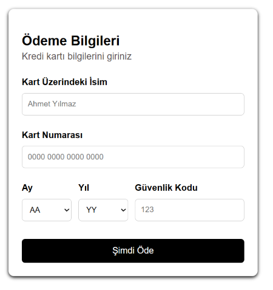

# 💳 React Ödeme Formu

Bu proje, React ve CSS kullanılarak oluşturulmuş basit bir kredi kartı ödeme formudur. Kullanıcıdan isim, kart numarası, son kullanma tarihi ve güvenlik kodu bilgileri alınır.

## ✨ Özellikler

- React functional component yapısı
- `useState` ile form verilerinin yönetimi
- CSS ile responsive ve sade tasarım
- Form gönderiminde sayfa yenilenmesini engelleme
- Bilgileri `alert` ile gösterme
- `select` elemanlarının kullanımı

## 🧩 Kullanılan Teknolojiler
React

CSS

JavaScript (SWC)

## 🖼️ Form Önizleme



## 🚀 Kurulum

Projeyi klonladıktan sonra terminalde aşağıdaki adımları izleyebilirsiniz:

```bash
https://github.com/kullaniciadi/my-project.git
cd my-project
npm install
npm run dev
```

